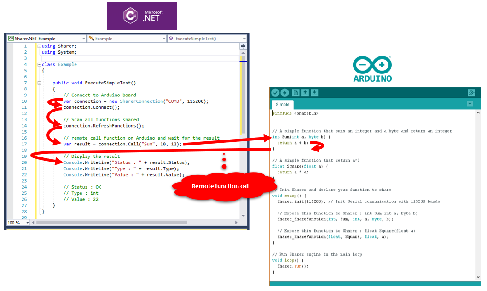
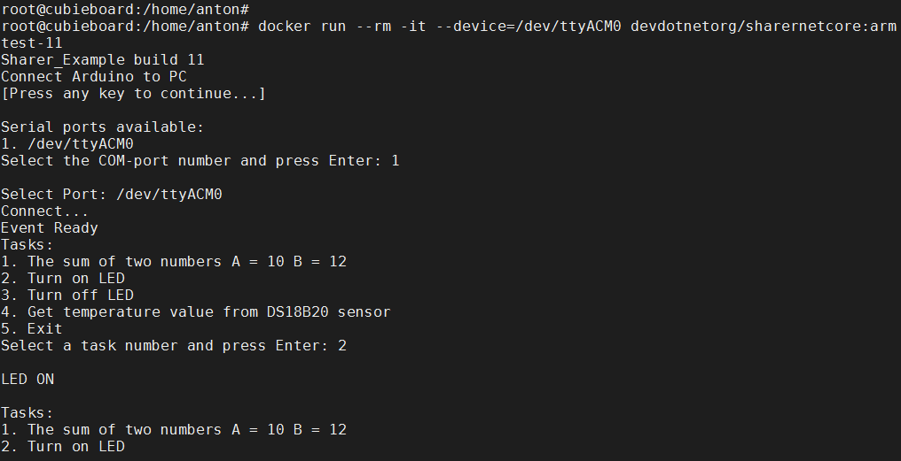

# Sharer-NETStandard


Sharer is an Arduino library that facilitates the communication between a PC(Windows, Linux), board ARM(Linux) and an Arduino board.
You chose the functions and variables you want to share with your application and your arduino board. Functions can be easily remotly called.


Link to [Arduino library Sharer](https://github.com/devdotnetorg/Sharer)



Tested on boards :
- Arduino UNO
- Arduino NANO
- Arduino MEGA
- Arduino DUE


## .NET C# code example


``` C#
// Connect to Arduino board
var connection = new SharerConnection("COM3", 115200);
connection.Connect();

// Scan all functions shared
connection.RefreshFunctions();

// remote call function on Arduino and wait for the result
var result = connection.Call("Sum", 10, 12);

// Display the result
Console.WriteLine("Status : " + result.Status);
Console.WriteLine("Type : " + result.Type);
Console.WriteLine("Value : " + result.Value);

// Status : OK
// Type : int
// Value : 22
```

## [Arduino code example](https://github.com/Rufus31415/Sharer.NET)

``` C++
#include <Sharer.h>

// A simple function that sums an integer and a byte and return an integer
int Sum(int a, byte b) {
	return a + b;
}

// A simple function that return a^2
float Square(float a) {
	return a * a;
}

// Init Sharer and declare your function to share
void setup() {
	Sharer.init(115200); // Init Serial communication with 115200 bauds

	// Expose this function to Sharer : int Sum(int a, byte b) 
	Sharer_ShareFunction(int, Sum, int, a, byte, b);

	// Expose this function to Sharer : float Square(float a)
	Sharer_ShareFunction(float, Square, float, a);
}

// Run Sharer engine in the main Loop
void loop() {
	Sharer.run();
}
```
## Usage

### Download and install the library
The library should be downloaded from GitHub and the Sharer folder copied into the \libraries folder.

### Initialisation
The communication between the .NET application and the Arduino is over the Serial protocole.
The Arduino code should initialize Sharer in the setup() function.
``` C++
#include <Sharer.h>

void setup() {
	// Initialize with Serial
	Sharer.init(115200);
	
	// Initialize with another Serial interface
	Serial2.begin(9600);
	Sharer.init(Serial2);
}
```

The loop() function should call Sharer.run().
``` C++
void loop() {
	Sharer.run();
}
```

### Share a function
 to be continued...

## .NET Standard 
The old Sharer.NET library from Rufus31415 only supported the .NET Framework. New Library **Sharer-NETStandard** based on [NET Standard 2.0](https://docs.microsoft.com/en-us/dotnet/standard/net-standard). Now **Sharer-NETStandard** can be used in .Net Core 3.1, Xamarin and .NET Framework, on OS Windows and Linux.

## Linux
When running on Linux (Ubuntu 16.04), errors occurred when calling functions: RefreshFunctions () and RefreshVariables (). A rough solution to the problem is to add a wait time before calling the Task.Delay (2000) .Wait () functions.

Example code with delays, the error does not appear:


``` C#
// Connect to Arduino board
// Scan all functions shared
	if (connection != null && connection.Connected)
    	{
            //Only required for Linux
            Task.Delay(2000).Wait(); // Wait 2 seconds with blocking
            connection.RefreshFunctions();
            //Only required for Linux
            Task.Delay(2000).Wait(); // Wait 2 seconds with blocking
            connection.RefreshVariables();
        }
```

ToDo: Solve the problem without Task.Delay(2000).Wait().

## Docker
### x86
To create a container for PC Linux, use the "Dockerfile" file.
Create a container:

``` bach
$git clone https://github.com/devdotnetorg/Sharer-NETStandard
$cd Sharer-NETStandard
$docker build --file Dockerfile -t devdotnetorg/sharernetcore:x86test-11 .
```

Run a container:
``` bach
$docker run --rm -it --device=/dev/ttyACM0 devdotnetorg/sharernetcore:x86test-11
```
where, /dev/ttyACM0 - Arduino Linux port(via USB). To see all available COM ports, run the command: $ls -l /dev | grep dialout


### ARM
To run on 32-bit ARM processors, use the file - "DockerfileARM".
Create a container:

``` bach
$git clone https://github.com/devdotnetorg/Sharer-NETStandard
$cd Sharer-NETStandard
$docker build --file DockerfileARM -t devdotnetorg/sharernetcore:armtest-11 .
```

Run a container:
``` bach
$docker run --rm -it --device=/dev/ttyACM0 devdotnetorg/sharernetcore:armtest-11
```
where, /dev/ttyACM0 - Arduino Linux port(via USB).


Test performed on board [Cubieboard A10](https://github.com/devdotnetorg/Cubieboard) OS [Armbian](https://www.armbian.com/cubieboard-1/) Ubuntu 18.04 .Net Core 3.1.

## Pictures:



Sharer.NET library author: [Rufus31415](https://github.com/Rufus31415/Sharer).


The Sharer.NET library was ported by [Anton DevDotNet.Org](https://github.com/devdotnetorg/Sharer-NETStandard).


Author of Docker files [Anton DevDotNet.Org](https://github.com/devdotnetorg/Sharer-NETStandard).
